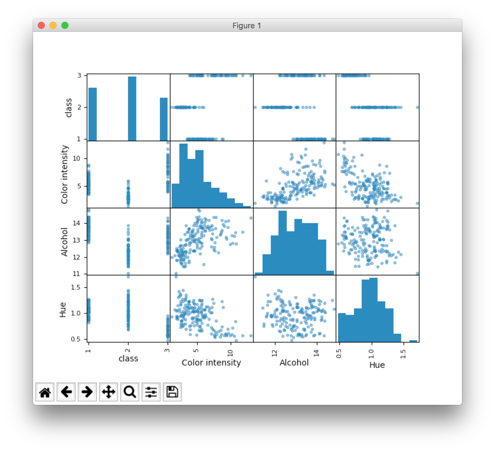

# Laboratorium 1

> Narzędzia, ramki i zbiory danych, ich statystyki opisowe, preprocessing i proste uczenie maszyn.

## Narzędzia [`1_tools.py`](1_tools.py)

Aby móc korzystać z _Pythona_, w systemie operacyjnym musimy zainstalować jego interpreter (_szok_). Najwygodniejszym rozwiązaniem w tym wypadku jest zainstalowanie pakietu [Anaconda](https://www.continuum.io/downloads), który zawiera już wszystkie narzędzia potrzebne do wykonywania eksperymentów z maszynami uczącymi się.

Aby sprawdzić, czy na twojej maszynie zainstalowany jest interpreter języka _Python_, zwyczajnie wpisz w terminalu komendę `python`. Jeśli wszystko jest w normie, odpowie Ci jego znak zachęty.

Pierwszy skrypt towarzyszący temu laboratorium importuje wszystkie potrzebne nam biblioteki i wyświetla ich wersje.

```python
import sys
import scipy as sp
import numpy as np
import matplotlib as plt
import pandas as pd
import sklearn as skl

print 'Python: %s' % sys.version
print 'scipy: %s' % sp.__version__
print 'numpy: %s' % np.__version__
print 'matplotlib: %s' % plt.__version__
print 'pandas: %s' % pd.__version__
print 'sklearn: %s' % skl.__version__
```

> **Zadanie 1:** Stwórz własny skrypt, w którym zaimportujesz wszystkie potrzebne biblioteki i przywitasz się ze światem.

## Ramki danych [`2_data_frame.py`](2_data_frame.py)

Krótkie wprowadzenie do języka _Python_:


- ten język jest prosty i jeśli umiesz programować w jakimkolwiek innym (a najpewniej umiesz), poradzisz sobie,
- komentujesz przy użyciu płotka (`#`),
- nie musisz deklarować typów zmiennych,
- zamiast klamerek stosujesz wcięcia (a więc znaczenie ma nie tylko wielkość znaków, ale i spacje).
- jeśli czegoś nie wiesz, wiesz, gdzie znajduje się [Stack Overflow](https://stackoverflow.com)

W tym zadaniu tworzymy tak zwaną _ramkę danych_, która różni się od klasycznej tablicy tym, że każdy wiersz i każda kolumna ma swoją nazwę. Będziemy potrzebować bibliotek `numpy` i `pandas`.

```python
import numpy as np
import pandas as pd
```

Na początek tworzymy tablicę. Nie jest to jednak tablica zwyczajna, a tablica `numpy`. Z pozoru nie różni się niczym od tej zadeklarowanej klasycznie, ale w rzeczywistości pozwala nam na skrócenie większości operacji i dzięki niej praktycznie niczego nie będziemy musieć wykonywać ręcznie.

```python
array = np.array([[1, 2, 3], [4, 5, 6]])
```

Chcemy jednak przygotować własną ramkę danych, a taka zawiera także opisy dla kolumn i wierszy. Przygotujmy sobie więc odpowiednie łańcuchy.

```python
index = ['first row', 'last row']
columns = ['was', 'is', 'will be']
```

Dysponując już wszystkimi potrzebnymi danymi, wykorzystując bibliotekę `pandas`, tworzymy ramkę danych.

```
dataFrame = pd.DataFrame(array, index=index, columns=columns)
```

> **Zadanie 2:** Wyświetl na ekranie utworzoną ramkę danych i zacznij chwalić się przed znajomymi, że programujesz w Pythonie.

## Zbiory danych [`3_dataset.py`](3_dataset.py)

Jeśli prowadzimy eksperymenty naukowe, z reguły wypada móc porównać swoje wyniki badań z innymi. W związku z tym, w przeważającej większości przypadków, testujemy nasze metody wykorzystując tak zwane _dane benchmarkowe_. Najbardziej powszechnie stosowanym źródłem takich danych jest [repozytorium UCIML](http://archive.ics.uci.edu/ml/).

Do niniejszej instrukcji dodany został plik [`wine.csv`](wine.csv), zawierający przykładowy, typowy zbiór danych, o którym więcej przeczytać możesz [na stronie repozytorium](http://archive.ics.uci.edu/ml/datasets/Wine). Zbiory najczęściej udostępniane są w formacie CSV. Jeśli nie wiesz, czym jest format CSV, nie przyznawaj się i sprawdź [w Wikipedii](https://en.wikipedia.org/wiki/Comma-separated_values). W skrócie to format tabeli, w którym wszystkie dane zapisujemy tekstowo, komórki oddzielamy przecinkiem, a kolejne wiersze – znakiem nowej linii.

Dla wygody, przed eksperymentami wczytujemy taki zbiór danych jako _ramkę danych_. Jak już wiesz, taka forma wymaga opisanych kolumn i wierszy. Opisem wiersza będzie w tym wypadku numer obiektu, więc nie musimy się nim martwić, ale opisy kolumn musimy już uzupełnić.

Przykładowo, dla zbioru `wine`:

```python
names = ['class', 'Alcohol', 'Malic acid', 'Ash', 'Alcalinity of ash ', 'Magnesium', 'Total phenols', 'Flavanoids', 'Nonflavanoid phenols', 'Proanthocyanins', 'Color intensity', 'Hue', 'OD280/OD315 of diluted wines', 'Proline']
```

Biblioteka `pandas` posiada wbudowaną funkcję wczytującą pliki CSV do ramek, więc używamy jej, aby odczytać nasz zbiór danych.

```python
data = pd.read_csv('wine.csv', names=names)
```

> **Zadanie 3:** Wybierz z repozytorium UCI jeden zbiór danych, przeczytaj jego opis i uzupełnij swój skrypt o wczytywanie tego zbioru, pamiętając o odpowiednim nazwaniu kolumn.

## Statystyki opisowe [`4_statistics.py`](4_statistics.py)

Wczytanie zbioru danych do dopiero początek _świetnej zabawy_. Jeśli mamy zajmować się jego przetwarzaniem, wypadałoby dowiedzieć się o nim czegoś więcej. Do tego przydadzą nam się statystyki opisowe.

Wobec ramki danych, możemy łatwo wyświetlić statystyki dla każdej z cech, korzystając z wbudowanej w bibliotekę `pandas` funkcji `describe()`.

```python
description = data.describe()
```

Przykładowy wynik takiej operacji może wyglądać jak poniżej:

```
class     Alcohol  Malic acid         Ash  \
count  178.000000  178.000000  178.000000
mean     1.938202   13.000618    2.336348
std      0.775035    0.811827    1.117146
min      1.000000   11.030000    0.740000
25%      1.000000   12.362500    1.602500
50%      2.000000   13.050000    1.865000
75%      3.000000   13.677500    3.082500
max      3.000000   14.830000    5.800000
```

> **Zadanie 4:** Uzupełnij swój skrypt o wyświetlanie statystyk opisowych cech zbioru danych. Wykorzystując swoją wiedzę z _Rachunku Prawdopodobieństwa_ i _Inżynierskich Zastosowań Statystyki_, w komentarzu, wyjaśnij każdą z wyświetlonych miar.

## Wizualizacja danych [`5_scatter_plot.py`](5_scatter_plot.py)

Jeśli nie radzisz sobie zbyt dobrze z interpretowaniem liczb i statystyki opisowe niewiele ci mówią, szczęśliwie, jest jeszcze dla ciebie nadzieja. Dane liczbowe możemy również wizualizować. W celu zobrazowania wczytanego zbioru użyjemy biblioteki `matplotlib`.

```python
import matplotlib.pyplot as plt
```

Naszym wyborem wizualizacji będzie _scatter plot_, który wyrysować potrafi, jak zawsze pomocna `pandas`.

```python
from pandas.tools.plotting import scatter_matrix
```

Zauważ, że tym razem nie zaimportowaliśmy całego modułu, a jedynie pojedynczą funkcję. Użyjmy jej więc do wyrysowania wizualizacji _scatter plot_.

```python
scatter_matrix(data)
plt.show()
```



> **Zadanie 5:** Przeszukaj dokumentację użytych bibliotek, aby dowiedzieć się jak wyrysować na ekranie histogram wybranej cechy i uczyń to dla swojego zbioru.

## Preproccesing[`preprocessing.py`](6_preprocessing.py)

Już niedługo będziemy mogli przystąpić do naszego pierwszego eksperymentu. Zanim to jednak nastąpi, musimy zapamiętać, jak istotnym jest tak zawany etap _preprocessingu_, czyli przetwarzania danych przed przekazaniem ich do algorytmu. Za przykład posłuży nam moduł `sklearn.preprocessing`.

```python
import sklearn.preprocessing as sklp
```

Na samym początku musimy podzielić zbiór danych na dwie części. Cechy (nazwiemy je podzbiorem `X`) i etykiety (podzbiór `Y`). W przypadku zbioru `wine`, etykiety (czyli inaczej informacja o klasie) znajdowały się w kolumnie pierwszej. Cechy stanowią całą resztę zbioru danych.

```python
X = array[:,1:]
Y = array[:,0]
```

W następnym kroku przeskalujmy podzbiór cech, dokonując ich _standaryzacji_, która w tym wypadku oznacza takie ich przetworzenie, aby średnia wartości wynosiła zero, a odchylenie standardowe było równe jeden.

```python
scaler = sklp.StandardScaler().fit(X)
rescaledX = scaler.transform(X)
```

Porównajmy ze sobą oryginalny i ustandaryzowany zbiór cech.

>X
```
[[  14.23    1.71    2.43   15.6   127.  ]
 [  13.2     1.78    2.14   11.2   100.  ]
 [  13.16    2.36    2.67   18.6   101.  ]
 [  14.37    1.95    2.5    16.8   113.  ]
 [  13.24    2.59    2.87   21.    118.  ]]
```

> rescaledX
```
[[ 1.519 -0.562  0.232 -1.17   1.914]
 [ 0.246 -0.499 -0.828 -2.491  0.018]
 [ 0.197  0.021  1.109 -0.269  0.088]
 [ 1.692 -0.347  0.488 -0.809  0.931]
 [ 0.296  0.228  1.84   0.452  1.282]]
```

## Uczenie
